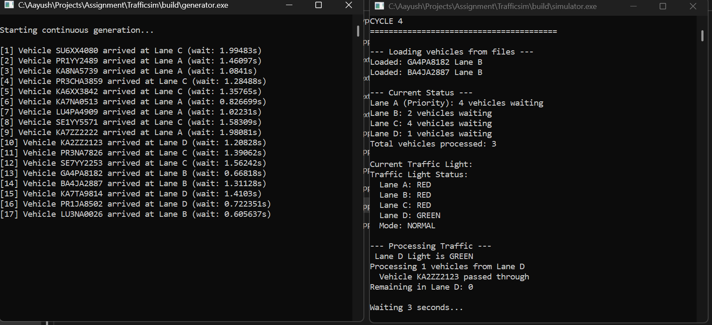
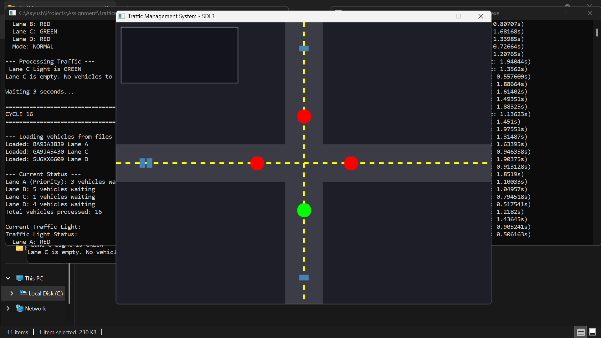

# Traffic Management Simulator using Queue Data Structure

**Course:** Data Structure and Algorithms (COMP202)  
**Assignment:** #1 - Queue Implementation for Traffic Light Problem  
**Student:** Aayush Adhikari  
**Roll Number:** 02  
**Instructor:** Rupak Ghimire  
**Institution:** Kathmandu University
**Date:** December 2025

---

##  Table of Contents

- [Overview](#overview)
- [Features](#features)
- [System Architecture](#system-architecture)
- [Installation & Setup](#installation--setup)
- [How to Run](#how-to-run)
- [Project Structure](#project-structure)
- [Data Structures Used](#data-structures-used)
- [Algorithm Explanation](#algorithm-explanation)
- [Screenshots](#screenshots)
- [References](#references)

---

##  Overview

This project simulates a **4-way traffic junction** with intelligent traffic light management using **Queue data structures** in C++. The system handles both normal and priority traffic conditions, implementing a fair vehicle dispatch system with visual simulation using SDL2.

### Problem Statement

A traffic junction connects two major roads forming a central point where vehicles must navigate through traffic lights. The system must handle:

- **Normal Condition:** Equal service to all lanes based on average queue length
- **Priority Condition:** Lane A becomes priority when >10 vehicles are waiting, served until <5 vehicles remain

---

##  Features

### Core Functionality
-  **Queue-based vehicle management** for 4 lanes (A, B, C, D)
-  **Priority lane detection** (Lane A with >10 vehicles)
-  **Dynamic traffic light control** with round-robin switching
-  **Real-time vehicle generation** with Nepali-style license plates
-  **File-based inter-process communication**
-  **SDL2 graphical visualization**

### Visual Features
-  Color-coded traffic lights (Red/Green)
-  Visual vehicle queue representation
-  Real-time statistics display
-  Road and lane markings

---

##  System Architecture

```
┌─────────────────┐         File I/O          ┌──────────────────┐
│  Generator      │ ──────────────────────────>│   Simulator      │
│  Process        │   lane_A/B/C/D.txt        │   Process        │
│                 │                            │                  │
│ - Random Vehicle│                            │ - Queue Manager  │
│ - Plate Creator │                            │ - Traffic Lights │
│ - Lane Selector │                            │ - SDL Renderer   │
└─────────────────┘                            └──────────────────┘
```

### Communication Method
**File-based IPC** - Generator writes vehicle data to lane-specific text files; Simulator reads and processes them.

---

## Installation & Setup

### Prerequisites

1. **C++ Compiler**
   - MinGW-w64 (for SDL build)
   - Visual Studio (for console build)

2. **SDL2 Library**
   ```bash
   # For MSYS2/MinGW64
   pacman -S mingw-w64-x86_64-SDL2
   ```

3. **Git** (for cloning repository)

### Clone Repository

```bash
git clone https://github.com/AayushAdhikari30/Trafficsim.git
cd Trafficsim
```

---

## 🚀 How to Run

### Method 1: SDL Graphical Simulation 

#### Step 1: Compile the Generator
```bash
g++ src/generator_main.cpp src/TrafficGenerator.cpp -o generator.exe
```

#### Step 2: Compile the SDL Simulator
```bash
# In MSYS2 MinGW64 terminal
g++ src/simulator_sdl.cpp src/TrafficManager.cpp src/TrafficLight.cpp \
    src/Vehicle.cpp src/FileReader.cpp src/SDLRenderer.cpp \
    -o simulator_sdl.exe \
    -lmingw32 -lSDL2main -lSDL2 \
    -I/mingw64/include/SDL2 -L/mingw64/lib
```

#### Step 3: Run Both Programs
```bash
# Terminal 1: Start the generator
./generator.exe

# Terminal 2: Start the simulator
./simulator_sdl.exe
```

### Method 2: Console-Only Simulation

#### Compile
```bash
g++ src/main.cpp src/TrafficManager.cpp src/TrafficLight.cpp \
    src/Vehicle.cpp src/FileReader.cpp -o simulator.exe
```

#### Run
```bash
# Terminal 1
./generator.exe

# Terminal 2
./simulator.exe
```

---

## Project Structure

```
Trafficsim/
├── src/
│   ├── Vehicle.h/cpp              # Vehicle class (license plate, lane, time)
│   ├── Queue.h                    # Generic queue template (linked list)
│   ├── TrafficLight.h/cpp         # Traffic light state management
│   ├── TrafficManager.h/cpp       # Core logic (priority detection, processing)
│   ├── TrafficGenerator.h/cpp     # Random vehicle generation
│   ├── FileReader.h/cpp           # File I/O operations
│   ├── SDLRenderer.h/cpp          # SDL2 graphics rendering
│   ├── main.cpp                   # Console simulator entry point
│   ├── simulator_sdl.cpp          # SDL simulator entry point
│   └── generator_main.cpp         # Generator entry point
│
├── lane_A.txt                     # Lane A vehicle queue file
├── lane_B.txt                     # Lane B vehicle queue file
├── lane_C.txt                     # Lane C vehicle queue file
├── lane_D.txt                     # Lane D vehicle queue file
│
├── README.md                      # This file
├── REPORT.md                      # Academic report
└── .gitignore                     # Git ignore rules
```

---

## Data Structures Used

| Data Structure | Implementation | Purpose | Time Complexity |
|----------------|----------------|---------|-----------------|
| **Queue** | Singly Linked List | Store vehicles waiting in each lane | Enqueue: O(1), Dequeue: O(1) |
| **Node** | Template struct | Queue's internal node structure | Access: O(1) |
| **Vector** | STL (temporary) | Batch file reading | Read: O(n) |
| **String** | STL | License plate storage | Access: O(1) |

### Queue Implementation Details

```cpp
template <typename T>
class Queue {
    struct Node {
        T data;
        Node* next;
    };
    Node* frontptr;  // Points to first element
    Node* backptr;   // Points to last element
    int count;       // Number of elements
};
```

**Operations:**
- `enqueue(item)` - Add to rear: **O(1)**
- `dequeue()` - Remove from front: **O(1)**
- `getFront()` - Peek front element: **O(1)**
- `isEmpty()` - Check if empty: **O(1)**
- `getSize()` - Get count: **O(1)**

---

## Algorithm Explanation

### Main Processing Algorithm

```
1. INITIALIZATION
   - Create 4 empty queues (Lane A, B, C, D)
   - Set traffic light to Lane A
   - Set priority mode = false

2. MAIN LOOP (Every 3 seconds)
   
   2.1 Load New Vehicles
       - Read lane_A.txt, lane_B.txt, lane_C.txt, lane_D.txt
       - Parse vehicle data (plate, lane)
       - Enqueue vehicles to respective lane queues
       - Clear files after reading
   
   2.2 Check Priority Condition
       IF laneA.size() > 10 THEN
           activatePriorityMode()
           currentLane = 'A'
       ELSE IF priorityMode AND laneA.size() < 5 THEN
           deactivatePriorityMode()
   
   2.3 Calculate Vehicles to Process
       IF priorityMode AND currentLane == 'A' THEN
           vehiclesToProcess = laneA.size()
       ELSE
           avg = (laneB.size() + laneC.size() + laneD.size()) / 3
           vehiclesToProcess = min(avg, currentQueue.size())
   
   2.4 Process Vehicles
       FOR i = 0 TO vehiclesToProcess
           vehicle = currentQueue.dequeue()
           totalProcessed++
   
   2.5 Switch Traffic Light
       IF priorityMode THEN
           currentLane = 'A'  // Stay on A
       ELSE
           currentLane = nextLane(currentLane)  // A→B→C→D→A

3. RENDER
   - Update SDL display
   - Show traffic lights, queues, statistics
```

### Priority Detection Algorithm

```
Function checkPriorityMode():
    laneASize = laneA.getSize()
    
    IF NOT priorityMode AND laneASize > 10:
        priorityMode = TRUE
        currentLane = 'A'
        PRINT "Priority mode activated"
    
    ELSE IF priorityMode AND laneASize < 5:
        priorityMode = FALSE
        PRINT "Priority mode deactivated"
```

### Time Complexity Analysis

**Overall System:** O(n) where n = total vehicles in all queues

**Per Cycle:**
- File Reading: O(m) where m = new vehicles
- Priority Check: O(1)
- Average Calculation: O(1)
- Vehicle Processing: O(k) where k = vehicles processed
- Total: **O(m + k)**

**Space Complexity:** O(n) for storing n vehicles across 4 queues

---


### Console Output
```
=== CYCLE 15 ===
Loaded: BA1PA2345 Lane A
Loaded: GA3KA6789 Lane B

--- Current Status ---
Lane A (Priority): 12 vehicles waiting
Lane B: 3 vehicles waiting
Lane C: 5 vehicles waiting
Lane D: 4 vehicles waiting
Total vehicles processed: 45

Traffic Light Status:
  Lane A: GREEN
  Lane B: RED
  Lane C: RED
  Lane D: RED
  Mode: PRIORITY (Lane A)

--- Processing Traffic ---
 Lane A Light is GREEN
Processing 12 vehicles from Lane A
  Vehicle BA1PA2345 passed through
  Vehicle LU2JA4321 passed through
  ...
```

---
## Screenshots
SDL Simulation View




##  Demo Video
https://github.com/user-attachments/assets/d37d09eb-3cad-4873-b142-fd0feaf37c13


##  References

### Technical Documentation
1. SDL2 Official Documentation - https://wiki.libsdl.org/SDL2/FrontPage
2. C++ Queue Implementation - GeeksforGeeks
3. Traffic Light Algorithms - IEEE Xplore

### Libraries Used
- **SDL2** (Simple DirectMedia Layer 2.0) - Graphics rendering
- **C++ STL** - Standard Template Library for utilities
- **Windows.h** - Sleep() function for timing

### Learning Resources
- Data Structures and Algorithms in C++ by Mark Allen Weiss
- SDL2 Tutorial by Lazy Foo' Productions
- File I/O in C++ - cplusplus.com

---

##  Author

**Aayush Adhikari**  
Roll Number: 02  
 Kathmandu University,Dhulikhel 
Email: [aayush.adhikari.9464@gmail.com]  
GitHub: [@AayushAdhikari30](https://github.com/AayushAdhikari30)

---

##  License

This project is submitted as part of academic coursework for COMP202 - Data Structure and Algorithms.

---

##  Acknowledgments

- **Rupak Ghimire** - Course Instructor
- Kathmandu University  - Department of Computer Science
- SDL2 Community - For excellent documentation

---

**Last Updated:** December 26, 2024
